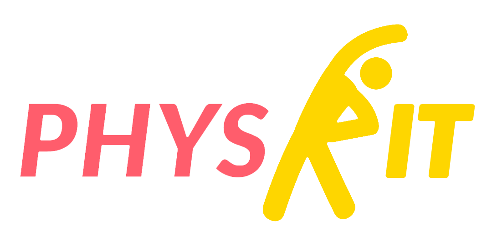

# Phys-it Application 👩‍⚕️

 

 

# The Future of Physio
Phys-it provides physiotherapy clinics a visual way to handle patient profiles. At its core, Phys-it features an intuitive and accurate **3D human model** to enter diagnostics for patients.

Phys-it’s goal is to innovate and improve how physiotherapists communicate with patients. By having 3D visuals, physiotherapists have the ability to show patients their injury visually and help them understand the scope of their injury.

Additionally, when symptoms and diagnosis are saved, a list of exercises will be auto-generated based on the entered diagnosis.

 

# Rehab in Motion 💪🦾
 

## The Team
### 🤓 Ringo Suen (CEO)
**Roles:**
- Product Design Lead
- Supporting Front-End Developer
- Project Manager / Scrum Master
- Pitch / Presentation Master
 

### 🧐 Kevin Vizconde (COO)
**Roles:**
- Lead Software Architect
- Lead Front-End Developer
- UI Designer
- GitHub Master
 

### 🥶 Daniel Chu (CFO)
**Roles:**
- Lead Back-End Developer
- Lead Database Engineer
- Supporting Software Architect
- UX/UI Designer
 

### 😴 Benson Wang (CBO)
- Supporting Back-End Developer
- Database Admin
- IT Tech Support
- Sales Support
